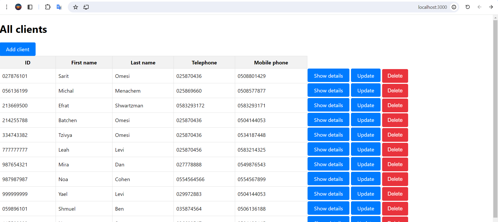

Exercise 1

A system of managing the covid-19 database for health fund.
Client side - react, server side - node.js, database - mysql.
First of all run the server and then run the app.
In order to run batchen_server : npm start,
In order to run batchen-app : npm start.
You should import the my_db.sql to your local mysql, and change the connection details as well. 

start:

start of adding new client:

display client:

update client:

Exercise 2
Program in c# - Twitter towers.

Exercise 3
PDF file - Airconditioner remote.